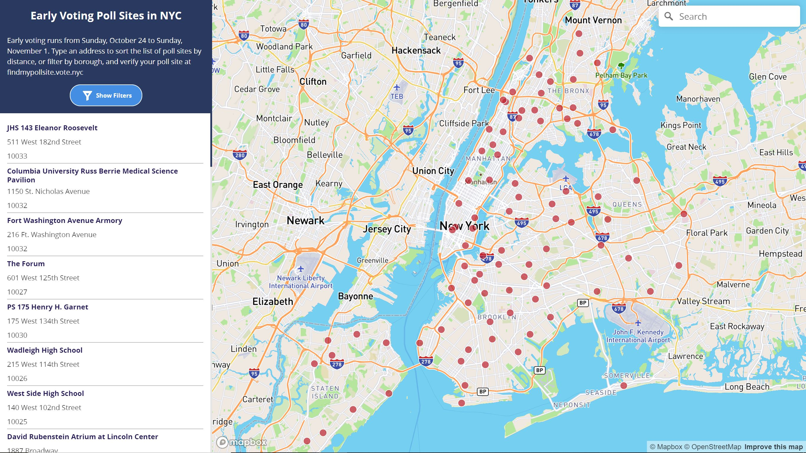

# [NYC Early Voting Poll Site Locator](https://jessica-mendieta.github.io/nyc-early-voting-poll-sites)

Map of early voting poll sites for the 2020 general election obtained from the [NYC Board of Elections](https://vote.nyc/page/early-voting-information) website. The locator tool filters by borough and shows the closest site to the address entered in the search bar. Be sure to [verify your poll site](https://findmypollsite.vote.nyc/) for the early voting period and day of the general election.

  

#### Early Voting Period for the Tuesday, November 3 General Election:

Date | Hours
-------- | --------
Saturday, October 24, 2020 | 10 AM to 4 PM
Sunday, October 25, 2020 | 10 AM to 4 PM
Monday, October 26, 2020 | 7 AM to 3 PM
Tuesday, October 27, 2020 |  12 PM to 8 PM
Wednesday, October 28, 2020 | 12 PM to 8 PM
Thursday, October 29, 2020 | 10 AM to 6 PM
Friday, October 30, 2020 | 7 AM to 3 PM
Saturday, October 31, 2020 | 10 AM to 4 PM
Sunday, November 1, 2020 | 10 AM to 4 PM

**Number of Early Voting Poll Sites and Registered Voters by Borough**

Borough	| Locations	| Registered Voters | Voters per Site
--------| ----------| ------- | --------
Manhattan | 16 | 1,209,469 | 75,592
The Bronx | 17 | 839,176 | 49,363
Brooklyn | 27 | 1,650,432 | 61,127
Queens | 18 | 1,297,536 | 72,085
Staten Island | 10 | 323,437 | 32,344
**Total** | **88** | **5,320,050** | **60,455**

*Registered Voters as of February 21, 2020*

#### Voter Registration Deadline and BOE Information

**Friday, October 9, 2020: Mail and In Person Voter Registration Deadline**. Applications must be postmarked no later than October 9, 2020 and received by a board of elections no later than October 14, 2020 to be eligible to vote in the General Election. You may register at your local board of elections or any state agency participating in the National Voter Registration Act, on any business day throughout the year but, to be eligible to vote in the General Election, your application must be received no later than October 9, 2020. If honorably discharged from the U.S. Military or have become a naturalized U.S. Citizen after October 9, 2020, you may register in person at the Board of Elections up until October 24, 2020.

**Contact the Board of Elections**: 
* Call the BOE: 1-866-Vote-NYC (1-866-868-3692)
* TTY-212-487-5496
* Twitter: @boenyc
* More Information: [vote.nyc](https://www.vote.nyc/)

#### Documentation 
* [Mapbox "Find Locations with Filters" Tutorial](https://labs.mapbox.com/education/impact-tools/finder-with-filters/)
* [Methodology](methodology)
* [Code Sample](config-capture.JPG)
* [Google Sheet](https://docs.google.com/spreadsheets/d/1ckRR_D1mOhPqYkL_mkFVijyU6jseHJBy922THPt4RFM/edit?usp=sharing)

#### Background
During the last week of September, a [story broke out](https://gothamist.com/news/brooklyn-voters-receive-absentee-ballot-envelopes-wrong-voter-names-and-addresses?fbclid=IwAR21jhwVsfbvlce2QMpIHcMk3P84ZSwJANl7Q32qgMQ0wef0XwhBQiY4dSo) that showed thousands of voters in Brooklyn had received absentee ballots with incorrect information. This raised concerns about voter disenfranchisement and the vendor selection process, as well as voters' faith in the Board of Elections at the state and local level - this followed a lengthy process to count all ballots after the June primary. While the root of the error has not been addressed, this story showed that early in person voting is one of the best ways to make sure each vote is counted. I made the map to show any poll site concentrations, whether they are in areas that are accessible to residents, and to introduce a template for future elections that makes it easier to have this same information (location and voting period) translated and for community organizations to develop outreach strategies to increase voter turnout safely.
